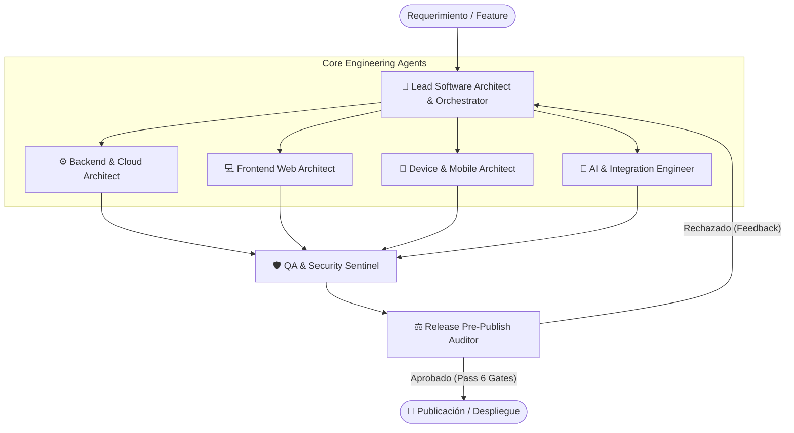

# 🏛️ Multi-Agent Architecture: Full-Stack & Device Engineering Team

Equipo agéntico especializado en diseño, arquitectura, implementación y auditoría de plataformas Web y Móviles complejas, de alta escala y multi-tenant.

---

## 👥 Matriz de Roles y Especialización

| Agente | Rol Clave | Responsabilidades Primarias | Tech Stack & Herramientas |
| :--- | :--- | :--- | :--- |
| **`lead-orchestrator`** | **Orquestador Principal** | Descomposición de requerimientos, diseño de ADRs, validación de aislamiento multi-tenant, asignación de tareas y validación del DoD. | Task Graph, Event-Driven Specs, ADRs, Diagramas C4 |
| **`backend-cloud-architect`** | **Backend & Infraestructura** | APIs de alta concurrencia, esquemas DB multi-tenant (RLS), Colas/Background Jobs, Caching y Zero-Trust IAM. | Node.js/Go, PostgreSQL/Supabase, Redis, BullMQ, Kafka, Docker |
| **`frontend-web-architect`** | **Web Full-Stack** | SPAs/SSRs reactivos, WebSockets en tiempo real, State Machines, Core Web Vitals, Design Systems y optimización de renderizado. | Next.js, React, TypeScript, TanStack Query, Zustand, TailwindCSS |
| **`mobile-device-architect`** | **Mobile & Hardware** | Arquitecturas offline-first, CRDTs, drivers de hardware (BLE, GPS, Cámara, Sensores), ciclo de vida nativo y Background Tasks. | React Native / Expo, Flutter, Android/Kotlin, iOS/Swift, SQLite, WatermelonDB |
| **`ai-data-integrator`** | **IA & Integraciones** | Esquemas JSON rigurosos para Tool Calling, pipelines RAG, Vector Stores, Webhooks seguros e integraciones de terceros. | OpenAI/Gemini SDKs, LangChain/LlamaIndex, pgvector, Stripe/Twilio APIs |
| **`qa-security-sentinel`** | **Seguridad & Calidad** | Auditoría OWASP Top 10, pruebas E2E, fuzzing de contratos de API, análisis de memoria/latencia y observabilidad estructurada. | Playwright, Detox, Vitest/Jest, k6, Sentry, Pino/Winston |
| **`release-pre-publish-auditor`** | **Auditor Pre-Publicación (Gatekeeper)** | Verificación estricta de las 6 puertas de control pre-despliegue: Multi-Tenancy/RLS, Cero `any`, Cero secrets expuestos, logs estructurados, resiliencia offline y contratos. | Zod, TypeScript Compiler (`tsc --noEmit`), Git Diff Inspector, Security Linters |

---

## 🛑 Protocolo de las 6 Puertas de Auditoría Pre-Publicación

Antes de autorizar cualquier publicación a producción o fusión a la rama principal:

1. **Gate 1: Multi-Tenancy & RLS**: RLS forzado en toda tabla Postgres/Supabase y filtros explícitos por `organization_id`.
2. **Gate 2: Type Safety & Compilación**: Cero tipos `any`, compilación limpia sin errores.
3. **Gate 3: Seguridad & Fugas**: Cero secretos/credenciales en código, sanitización total contra SQLi/XSS.
4. **Gate 4: Observabilidad**: Logs estructurados en JSON con contexto (`tenant_id`, `trace_id`, `duration_ms`).
5. **Gate 5: Mobile & Offline Sync**: Persistencia local con cola de sincronización resiliente y liberación de listeners de hardware.
6. **Gate 6: Contratos & DoD**: Validación de esquemas Zod en todas las entradas/salidas y actualización de documentación de arquitectura.
