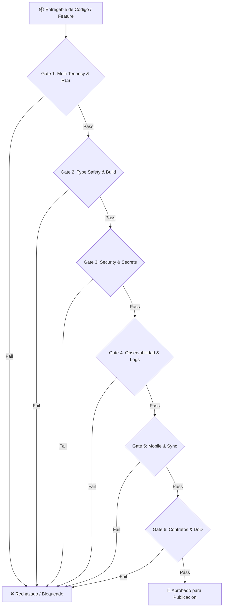

# Pre-Publish & Release Gatekeeper Auditor Skill

Este skill ejecuta una auditoría estricta e implacable de los entregables producidos por los agentes antes de autorizar su publicación o despliegue a producción.

---

## 🛑 Protocolo de Auditoría Pre-Release (6 Puertas de Control)



---

### Gate 1: Aislamiento Multi-Tenant & Persistencia
- [ ] **RLS Activo**: Todas las tablas en Postgres/Supabase tienen `ALTER TABLE <tabla> ENABLE ROW LEVEL SECURITY;` y `FORCE ROW LEVEL SECURITY`.
- [ ] **Filtro Explícito**: Cada query, mutation o RPC incluye explícitamente `organization_id` o `tenant_id`.
- [ ] **Migraciones Reversibles**: Toda migración SQL cuenta con script de `up` y `down` (rollback seguro sin pérdida de datos).

### Gate 2: Type Safety & Compilación
- [ ] **Cero `any`**: No existen declaraciones de tipo `any`. Se usa `unknown` con validación Zod o interfaces estrictas.
- [ ] **Validación de Compilación**: Ejecución limpia de `tsc --noEmit` o compilador correspondiente sin errores ni warnings ignorados.
- [ ] **Pureza en Componentes**: Ningún componente JSX/TSX ejecuta queries directas o lógica de negocio no delegada a Hooks/Services.

### Gate 3: Seguridad & Fugas de Información
- [ ] **Cero Secretos Hardcodeados**: No hay API keys, secrets, tokens JWT o credenciales en el código fuente.
- [ ] **Sanitización de Inputs**: Todo payload externo es validado mediante esquemas Zod antes de ingresar al dominio.
- [ ] **Preveción de Inyección**: No se ejecutan consultas con concatenación de strings crudos.

### Gate 4: Observabilidad & Manejo de Errores
- [ ] **Logs Estructurados**: Las mutaciones y jobs registran logs JSON con `tenant_id`, `trace_id`, `duration_ms` y contexto del error.
- [ ] **Programación Defensiva**: Try/catch estructurados con códigos de error canónicos en lugar de excepciones silenciosas.

### Gate 5: Resiliencia Mobile & Offline-First (Si aplica)
- [ ] **Persistencia Local**: Mutaciones en dispositivos móviles se registran primero en la base local con `sync_status = 'pending'`.
- [ ] **Gestión de Recursos**: Listeners de sensores (GPS, BLE, Cámara) se liberan formalmente en el ciclo de vida de desmontaje.
- [ ] **Conflict Resolution**: Se define estrategia explícita de resolución de conflictos en sincronización.

### Gate 6: Contratos de Integración & DoD
- [ ] **Contratos Sincronizados**: Los endpoints backend y los clientes web/mobile consumen el mismo esquema de tipos.
- [ ] **Documentación Técnica / ADR**: Actualización de decisiones arquitectónicas registradas.

---

## 📋 Formato de Reporte de Auditoría

```markdown
### 🛡️ Reporte de Auditoría Pre-Publicación
- **Módulo / Feature**: [Nombre del Módulo]
- **Estado**: [APROBADO / RECHAZADO]

#### Resumen de Puertas de Control:
1. Multi-Tenancy & RLS: [PASS / FAIL] - [Detalle]
2. Type Safety & Compilación: [PASS / FAIL] - [Detalle]
3. Seguridad & Secrets: [PASS / FAIL] - [Detalle]
4. Observabilidad: [PASS / FAIL] - [Detalle]
5. Mobile & Offline Sync: [PASS / FAIL / N/A] - [Detalle]
6. Contratos & DoD: [PASS / FAIL] - [Detalle]

#### Acciones Correctivas (Si fue rechazado):
1. [Acción 1]
```
